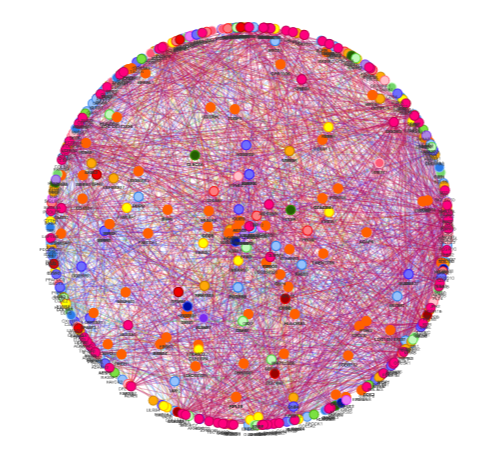

### Python3 implementation of the Leading Eigenvector Algorithm for Community Detection in Undirected Connected Graphs

Implements the Leading Eigenvector Algorithm described by M. E. J. Newman in _Finding community structure in networks using the eigenvectors of matrices_.

This is a [modularity](<https://en.wikipedia.org/wiki/Modularity_(networks)>) optimization algorithm which works by using the leading eigenvector of the modularity matrix to approximate a good way to split a network. The main idea behind this algorithm is derived from this formula for the change in modularity:

    

 

Where _B_ is the modularity matrix, _m_ is the sum of the weight of all edges in the graph, &delta; is the Kronecker delta equation, and _s_ is a vector with "instructions" on how to divide the graph. So in essence, since nothing can be changed aside from _s_, this algorithm seeks to maximize &Delta;Q by finding the best vector _s_, which in this case happens to be the leading eigenvector.

### Algorithm Steps

1. Generate an adjacency matrix from a list of all edges in the graph.
2. Generate the modularity matrix using the adjacency matrix.
3. Find the leading eigenvector (eigenvector matching the eigenvalue with the greatest magnitude), let's call it _v_.
4. Use the signs of the values inside _v_ to decide how to split the graph, for example if _v_[0] is negative, _v_[1] is positive, and _v_[2] is negative, that means nodes 0 and 2 belong to one group, and node 1 belongs to the other group.
5. Repeat steps 1 through 4 for the graphs generated by the divisions in step 4 until &Delta;Q (calculated using the formula below) is &leq; 0.

    

### .xslx Output

By default the program writes the results to an .xlsx file file where the first sheet contains the groups, where each column has the group label as a header and underneath it are all the members of that group. The second sheet onwards contain the actual graph structure for each group, so for example the second sheet contains a list of all edges in the first group found. Here are some examples:

  
The following examples use this graph as its input.

  
  

  
Example of the labelled sheets in the .xlsx file

  

  
Example of the groups

  

  
Example of an edge list

  

### .html Output

If you set visualize=True in Detector.getLECommunities(), an output .html file will be created using pyvis and automatically opened in the user's default browser that will create a visualization of all separate groups with the node labels, where groups are color coded. The visualization can be zoomed in and out, and the graph is interactable.

  
Example of the color coded output groups when visualize=True

  

For very large networks, the input will look messy initially, as is the case for this example of a 700 node 7,000 edge network. Simply enable the physics engine in the bottom left of the screen, and this will apply "gravity" between the groups which will cause them to spread apart. If enabled from the start, this could cause the .html to take a very long amount of time to load, as such, it's initially disabled, and left to the user to enable on demand.

  
Images of a 700 node 7,000 edge graph visualization before and after physics are applied

  
  

  
Image of the physics menu

  

### Command Line Output

If you set log=True in Detector.getLECommunities(), information about the process will be printed to the console, this can be useful to check progress as well as to time each step in the process.

  
Example command line output when log=True

  

